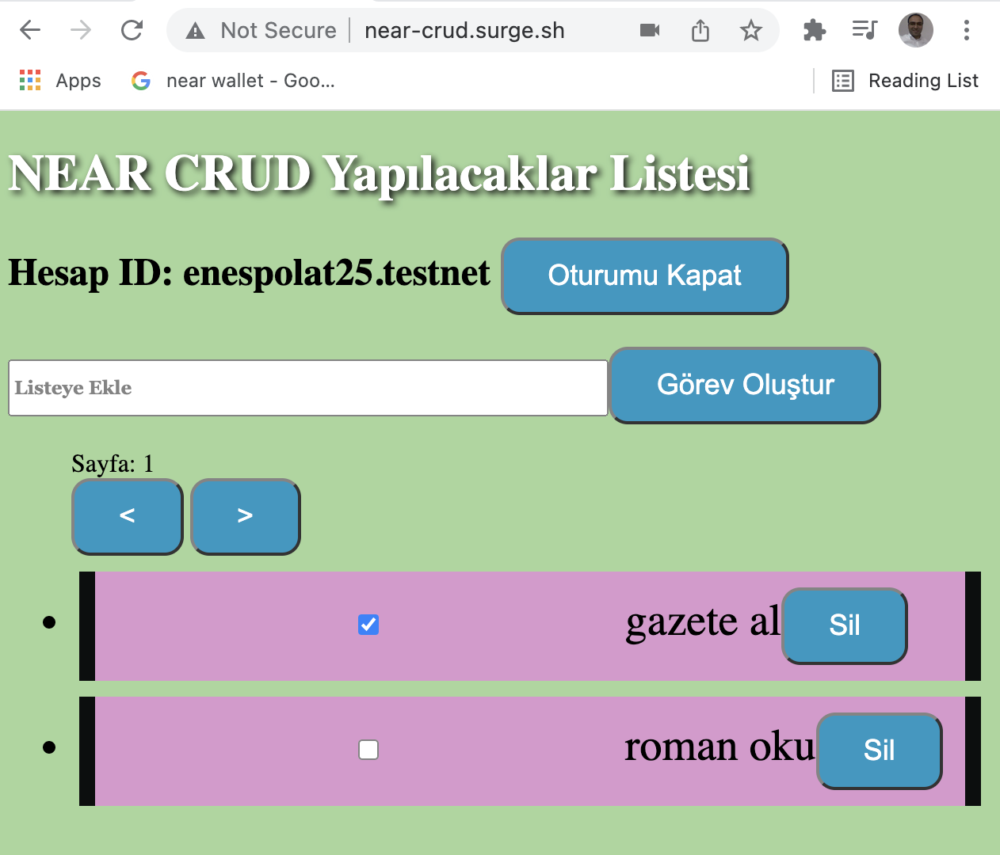

# CRUD App Tutorial

This contains the finished code for the tutorial on [building a CRUD dApp](https://docs.near.org/docs/tutorials/apps/todos-crud-app)

# Notes

The application will consist of two distinct layers:

- Smart contract (in web2 we may refer to this as server-side or back-end)
- Web app (in web2 we may refer to this as client-side or front-end)

## Working

**Contracts: `/todos-crud-contract/`**
1. install dependencies `cd todos-crud-contract && yarn`
2. run tests - `yarn test`
3. compile the contract - `yarn build`
4. deploy the contract - `yarn deploy`
 
**App Tests: `/todos-crud-web/`**
1. install dependencies `cd todos-crud-web && yarn`
2. start the server - `yarn start`

## Notes

- If you deploy the contract, make sure to edit the `CONTRACT_NAME` found in `todos-crud-web/src/config.js` to match your deployed contract. 
- You must be logged in to interact with the app. If you don't have a NEAR wallet, click [here](https://wallet.testnet.near.org/) to make one.
